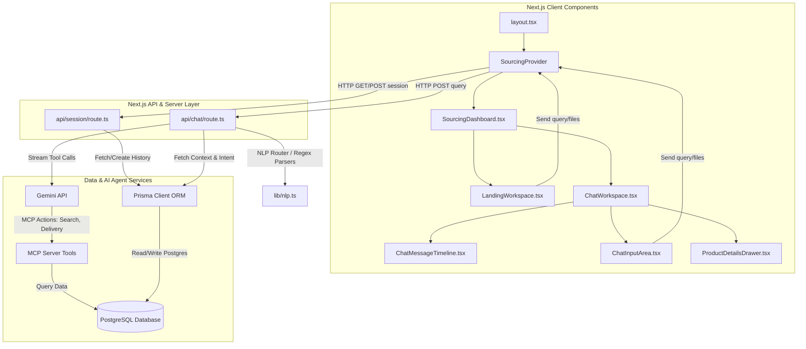

# Kapruka AI Shopping Sourcing Agent - Developer Guide

This guide provides an overview of the system architecture, directory structures, database setup, and local development runbook for handover.

---

## 1. System Architecture

The application is structured as a Next.js App Router project integrating a local PostgreSQL database (managed via Prisma) and an AI Sourcing Agent utilizing the Model Context Protocol (MCP) to access the database catalog and delivery rate checking tools.



### Key Flow Mechanisms
- **State Hydration**: Persistent chat states are kept inside the React Context (`SourcingProvider` inside `SourcingContext.tsx`). This allows seamless transitioning between landing pages and conversation views without flashing or page reloads.
- **MCP Tool Execution**: When a query is routed to `/api/chat`, the server evaluates the text using rule-based intents and regex parsers in `nlp.ts`, fetches history from PostgreSQL via Prisma, and initializes a conversation with Gemini. Gemini triggers MCP tools (like checking delivery via Kandy/Colombo routes, local SME filters, or pricing searches) before outputting the final styled markdown response to the client.

---

## 2. Directory Structure

Following the recent modularization, components are structured with highly focused single-responsibilities:

```text
src/
├── app/
│   ├── api/
│   │   ├── chat/          # Chat endpoint handling NLP classification & Gemini streaming
│   │   └── session/       # Session creation, listing, and hydration endpoints
│   ├── c/[id]/            # Dynamic conversation dynamic route
│   ├── layout.tsx         # Root layout with suppressHydrationWarning and Context provider
│   └── page.tsx           # Entrypoint dashboard redirector
├── components/
│   ├── chat/
│   │   ├── cards/
│   │   │   ├── DeliveryCard.tsx       # Perishable alerts & Grasshoppers rates
│   │   │   ├── ImportEstimateCard.tsx  # Landed cost import duties table
│   │   │   ├── ServiceListingCard.tsx  # Verified local technician listings
│   │   │   └── TrackingCard.tsx       # Order delivery status timelines
│   │   ├── ChatInputArea.tsx          # Floating bottom textarea & upload controls
│   │   ├── ProductCard.tsx            # Grid/List item with SME/Discount flags
│   │   ├── ProductGrid.tsx            # View toggles & paginated display grids
│   │   └── ThinkingPanel.tsx          # Real-time animated thought steps & tool calls
│   ├── header/
│   │   ├── LanguagePopover.tsx        # Currency / flag configuration select
│   │   └── LocationPopover.tsx        # Local ZIP / delivery location specifiers
│   ├── landing/
│   │   └── PillarSuggestionGrid.tsx   # Color-coded 5-pillar hint cards
│   ├── GlobalHeader.tsx               # Main global navbar
│   ├── GlobalSidebar.tsx              # Collapsible dashboard drawer
│   ├── SourcingDashboard.tsx          # Layout coordinator orchestrating screen changes
│   ├── ChatMessageTimeline.tsx        # AI Timeline list of message elements
│   ├── ProductDetailsDrawer.tsx       # Detailed item comparison slide-over panel
│   └── ProductCatalogModal.tsx        # Detailed item paginated list portal modal
├── context/
│   └── SourcingContext.tsx            # Global Context Provider for sourcing session state
├── lib/
│   ├── config.ts                      # Strict, type-safe environment variable assertions
│   └── nlp.ts                         # Decoupled NLP routing, order ID, and price parsing regexes
└── types/
    └── sourcing.ts                    # Centralized models for Messages, Products, Cards, etc.
```

---

## 3. Environment & Database Setup

The database layer is managed through **PostgreSQL** (packaged inside Docker Compose) and **Prisma ORM**.

### 3.1 Initial Setup
1. Copy the example configuration template:
   ```bash
   cp .env.example .env
   ```
2. Start the database service:
   ```bash
   docker-compose up -d
   ```
3. Run migrations and push schemas:
   ```bash
   npx prisma db push
   ```
4. Seed the product catalog and mock services:
   ```bash
   npx prisma db seed
   ```

### 3.2 Troubleshooting DLL Permission Errors
When Next.js runs in development mode (`npm run dev`), Turbopack processes hold locks on files inside the project structure. Running `npx prisma generate` might fail with:
`Error: EPERM: operation not permitted, unlink '...\query_engine-windows.dll.node'`

**Workaround**:
- Schema modifications do not require client generation unless database models change. Use `npx prisma db push` to push modifications without triggering engine compilations.
- If engine generation is required, temporarily stop the development server (`Ctrl+C`), generate the client via `npx prisma generate`, and restart the dev server.

---

## 4. Local Development Runbook

Use the following scripts to boot, verify, and validate the code structure locally:

### 4.1 Development Server
Start the development server with live reload and Turbopack enabled:
```bash
npm run dev
```

### 4.2 Code Quality & Verification
To ensure all component linkages, types, and properties are robust:

1. **Linting Check**: Run ESLint to catch unused imports or invalid React Hooks usages:
   ```bash
   npm run lint
   ```
2. **Type Compatibility Check**: Verify TypeScript compiler integrity:
   ```bash
   npx tsc --noEmit
   ```
3. **Build Compilation Check**: Ensure Next.js builds successfully for production:
   ```bash
   npm run build
   ```
