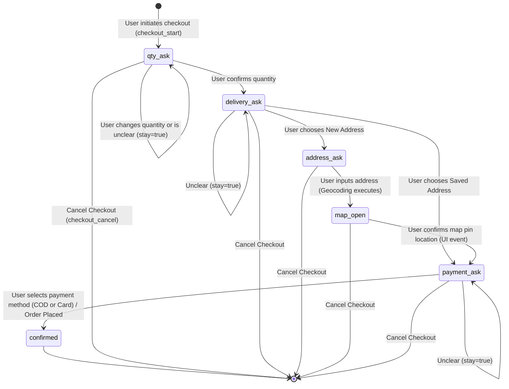

# Kapuruka AI Sourcing Agent — System Architecture

This document details the system architecture and agent workflows for the
**Kapuruka AI Sourcing Agent** (Kapuruka.com AI Mode). The platform utilizes an
agentic multi-agent architecture to orchestrate product discovery, cart
management, checkout state machine progress, logistics tracking, and home
service providers.

---

## 1. System Overview & Architecture

The architecture consists of:

1. **Next.js Edge Endpoint Router** (`src/app/api/chat/route.ts`): The system's
   main orchestrator. It receives user messages, maintains session DB state,
   executes intent classification, coordinates the Router Agent, runs the
   business logic, and streams the responses using Server-Sent Events (SSE).
2. **Intent & Search Classifier (LLM-based)**: Runs a 1st-pass classification to
   determine query relevance, extract precise search keywords, and identify the
   user's primary intent (`product`, `category_browse`, `delivery`, `service`, `qa`, `reorder`).
3. **Router Agent** (`src/lib/agents/routerAgent.ts`): A specialized LLM-based
   coordinator that decides which macro action to execute (`shop`,
   `checkout_start`, `checkout_continue`, `checkout_pause`, `cart_modify`,
   `checkout_cancel`).
4. **Cart Modifier Agent** (`src/lib/agents/cartModifierAgent.ts`): Parses
   free-form text to perform structured cart additions, removals, or quantity
   updates.
5. **Order Agent** (`src/lib/agents/orderAgent.ts`): Handles the conversational
   checkout state machine and extracts structured parameters like address names,
   coordinates, and payment methods.
6. **Pillar Tool Layer** (`src/lib/tools.ts`): Interacts with the Kapruka Model
   Context Protocol (MCP) server, external geocoding interfaces, local home
   services registries, and Google Search Grounding.

---

## 2. Complete Agent Working Flow

The diagram below represents the complete request lifecycle, showing how
incoming messages are parsed, classified, routed, and handled by the specialized
agents.

```mermaid
flowchart TD

    %% Styling Classes
    classDef client fill:#E1F5FE,stroke:#0288D1,stroke-width:2px,color:#01579B;
    classDef core fill:#E8F5E9,stroke:#388E3C,stroke-width:2px,color:#1B5E20;
    classDef agent fill:#FFF3E0,stroke:#F57C00,stroke-width:2px,color:#E65100;
    classDef db fill:#ECEFF1,stroke:#455A64,stroke-width:2px,color:#263238;
    classDef ext fill:#F3E5F5,stroke:#7B1FA2,stroke-width:2px,color:#4A148C;

    %% Nodes
    User["User (Web Client)"]:::client
    POSTChat["POST /api/chat handler<br/>src/app/api/chat/route.ts"]:::core
    DB[("Prisma DB<br/>Chat Messages, Session, Cart, Orders")]:::db

    %% Initial Flow
    User -->|User Message + Selected Products| POSTChat
    POSTChat -->|Save User Message / Fetch History| DB

    %% Intent Classification
    IntentClassifier["1st Pass: Intent & Search Term Classifier<br/>(Gemini)"]:::core

    POSTChat --> IntentClassifier
    IntentClassifier -->|Intent: product / delivery / service / qa / reorder| POSTChat

    %% Router
    RouterAgent["Router Agent<br/>(src/lib/agents/routerAgent.ts)"]:::agent

    POSTChat -->|Route Decisions<br/>History + Checkout State| RouterAgent

    RouterAgent -->|Decides Action| ActionSwitch{"Action?"}:::agent

    %% Branches
    ActionSwitch -->|checkout_cancel| CancelHandler["Cancel Checkout Flow"]:::core
    ActionSwitch -->|checkout_start| StartHandler["Start Checkout Flow"]:::core
    ActionSwitch -->|cart_modify| CartModifyHandler["Cart Modification Flow"]:::core
    ActionSwitch -->|checkout_continue| CheckoutContinueHandler["Checkout Progress Flow"]:::core
    ActionSwitch -->|shop / checkout_pause| ShopHandler["Shop / General Q&A Flow"]:::core

    %% Cancel Flow
    CancelHandler -->|Clear checkout state & cart| DB
    CancelHandler -->|Stream cancelled event| User

    %% Start Flow
    StartHandler -->|Load cart| DB
    StartHandler -->|Check Stock| MCPEcommerce["Kapruka MCP Server"]:::ext
    StartHandler -->|Save State: qty_ask| DB
    StartHandler -->|Stream qty_ask event| User

    %% Cart Modification
    CartModifier["Cart Modifier Agent<br/>(src/lib/agents/cartModifierAgent.ts)"]:::agent

    CartModifyHandler -->|Analyze message & products| CartModifier
    CartModifier -->|add/remove/update_qty| CartModifyHandler
    CartModifyHandler -->|Apply modifications & Save Cart| DB
    CartModifyHandler -->|Reset phase to qty_ask if needed| DB
    CartModifyHandler -->|Stream updated cart| User

    %% Checkout Continue
    OrderAgent["Order Agent<br/>(src/lib/agents/orderAgent.ts)"]:::agent

    CheckoutContinueHandler -->|Process current phase| OrderAgent
    OrderAgent -->|Extract qty/address/payment/nextPhase| CheckoutContinueHandler

    Geocoding["Google Geocoding API"]:::ext
    OrderAPI["POST /api/order"]:::core

    CheckoutContinueHandler -->|address_ask → map_open| Geocoding
    CheckoutContinueHandler -->|payment_ask → confirmed| OrderAPI

    OrderAPI -->|Place Order via MCP| MCPEcommerce
    OrderAPI -->|Save Order & Clear Cart| DB

    CheckoutContinueHandler -->|Update Checkout State| DB
    CheckoutContinueHandler -->|Stream next phase| User

    %% Shop Flow
    SearchProducts["searchProducts MCP"]:::ext
    CategoryAgent["Category Browse Agent<br/>(Gemini)"]:::agent
    Scraper["Cheerio HTML Scraper"]:::core
    RelevanceCheck["Gemini Validator"]:::core
    LogisticsAPI["Grasshoppers Logistics MCP"]:::ext
    SMETagging["SME Tagging & Sorting"]:::core
    ServiceRegistry["Local Service Registry (Stub)"]:::core
    GroundingSearch["Google Search<br/>(Gemini Grounding)"]:::ext

    ShopHandler -->|Pillar 1: Product Search| SearchProducts
    ShopHandler -->|Pillar 6: Category Browse| CategoryAgent

    CategoryAgent -->|Extract Subcategories| Scraper
    SearchProducts --> RelevanceCheck
    Scraper -->|Merge & Deduplicate| RelevanceCheck
    RelevanceCheck --> ShopHandler

    ShopHandler -->|Pillar 2: Logistics| LogisticsAPI
    ShopHandler -->|Pillar 3: SME / Partner Central| SMETagging
    ShopHandler -->|Pillar 5: Home Services| ServiceRegistry
    ShopHandler -->|Pillar 4 / QA| GroundingSearch
    
    ReorderFlow["NLP Reorder Flow<br/>(Order History)"]:::core
    ShopHandler -->|Intent: reorder| ReorderFlow
    ReorderFlow -->|Check Missing Info| Clarify["Ask Clarification<br/>(Return Early)"]:::core
    Clarify --> User
    ReorderFlow -->|Filter by Target/Date| DB
    ReorderFlow --> ShopHandler

    LogisticsAPI --> ShopHandler
    SMETagging --> ShopHandler
    ServiceRegistry --> ShopHandler
    GroundingSearch --> ShopHandler

    ShopHandler -->|Generate Structured Stream| User
    ShopHandler -->|Save Response & Product Groups| DB
```

---

## 3. Conversational Checkout State Machine

The checkout lifecycle is modeled as a state machine managed cooperatively by
the **Router Agent** (directing input to continue or pause), **Order Agent**
(evaluating phase answers and deciding transitions), and **Next.js Handler**
(handling API/DB actions).

---

## 4. Component Details & Design Decisions

### A. Intent & Search Classification

The classification block acts as a gateway to check queries against safety
guidelines, detect product nouns, and extract price limits. This prevents
unrelated prompts (e.g. coding requests) from using token resources on product
database queries. It also identifies when a user is making a broad/generic query
(e.g., "flowers", "anniversary gifts") and routes them to the Category Browse
pillar.

### B. The Router Agent (`routerAgent.ts`)

Operating entirely without regex rules, this agent determines the action based
on the state. For example:

- **`checkout_pause`**: Occurs if the user is in the middle of checking out but
  asks a question like _"What is the return policy?"_. The agent pauses the
  checkout state machine, handles the support query in the shop loop, and keeps
  the cart active so they can resume later.

### C. Cart Modifier Agent (`cartModifierAgent.ts`)

Translates unstructured user intents (_"remove the second item"_, _"add the
cake"_) into structured changes. It pulls historical context from the last 5
assistant messages to know what products were recently viewed and available for
addition.

### D. Order Agent (`orderAgent.ts`)

Maintains conversation rules and extracts fields:

- `addressText`: Cleaned of conversational elements.
- `paymentMethod`: Classified into `"cod"` or `"card"`.
- It prompts the geocoder when transitioning from `address_ask` to `map_open`,
  positioning the user's interactive map interface accurately.

### E. Category Browse Agent (`categoryBrowseAgent.ts`)

For broad exploratory queries, this agent evaluates the user's request against a
cached Kapruka category tree.

- It selects the 1-3 best subcategories.
- It performs **Semantic Concept Grouping** by combining similar subcategories
  (e.g., "Love and Romance" and "Flower Bouquets") into a single "Flowers"
  group. This prevents the UI from rendering duplicate components for the same
  conceptual item.

### F. Multi-Pillar Integrations

- **Pillar 1 (Domestic Catalog)**: Employs parallel variant query matching
  followed by a Gemini validation step (`llmValidateRelevance`). The validator
  assigns a `relevance_score` (1-100) to each product, sorting the highest
  matches to the top.
- **Pillar 6 (Category Browse)**: Scrapes Kapruka categories via Cheerio,
  extracting DOM/JSON-LD data. It dynamically disables discard constraints on
  the AI relevance validator to heavily aggressively filter out mismatched
  scraped items. Merged semantic groups are deduplicated by ID to ensure
  distinct UI rendering.
- **Pillar 2 (Grasshoppers Logistics)**: Accesses live availability timelines,
  rates, and tracking updates.
- **Pillar 3 (SME / Partner Central)**: Highlights small local businesses using
  artisan keyword matching.
- **Pillar 5 (Services)**: Maps queries to verified Sri Lankan technicians
  (electricians, plumbers, AC, cleaning, pest, paint, carpentry) filtered by
  target cities.
- **Q&A Grounding**: Utilizes Gemini Google Search tool features to answer
  questions about platform policies, refunds, or general queries.

### G. NLP-Driven Reorder Flow

Eliminates brittle regex by utilizing Gemini's semantic extraction to handle requests for past orders.
- Extracts `reorderTarget` (the specific item requested) and `reorderTimeline` (translating temporal phrases like "last week" into ISO 8601 Date strings).
- Implements a lightweight **Multi-turn Prompt Engineering** approach. If a user asks to reorder without providing a timeline or target, the system intercepts the request and issues a clarifying question (e.g., "Which item or roughly when did you buy it?"). The `historySnippet` context allows the LLM to successfully parse the user's next response without needing a rigid state machine.
- Queries Prisma (`Order` and `OrderItem`) with a `createdAt: { gte: date }` filter and seamlessly maps the history into `KaprukaProduct` formats for the frontend interactive UI.
